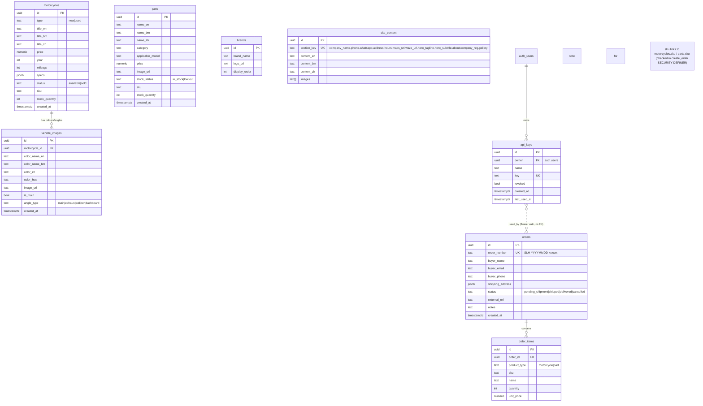

# Soon Lee Huat Motor — Database ER Diagram

Supabase (PostgreSQL) · ref `tyfcdbsiomsrramszqxc`
8 tables · RLS enabled (public read, authenticated write)

## Storage buckets (public)
`vehicle-images` · `part-images` · `brand-logos` · `gallery`

## Access pattern
- Public site: anon client → read motorcycles / parts / brands / site_content
- Admin: authenticated Supabase Auth → write all tables
- External v1 API: `Authorization: Bearer <api_key>` → `api_keys` table
  - `GET /api/v1/products` — return sku + price + stock_quantity + status
  - `POST /api/v1/orders` — `create_order()` deducts real stock (unknown_sku→400, insufficient_stock→409)
  - On failure → WhatsApp alert via `notify.ts` (Meta Cloud API)
